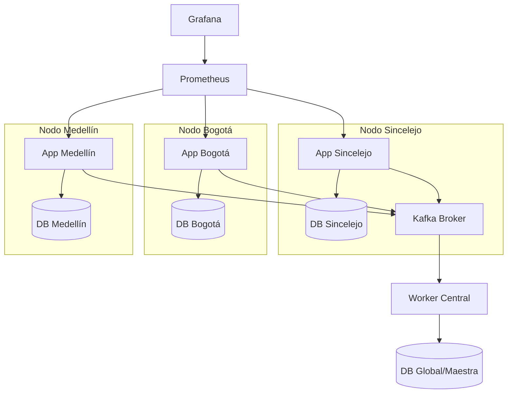

# Sistema Clínico Distribuido Interoperable (FHIR R4)

Este proyecto implementa un sistema de gestión de historias clínicas distribuido en tres nodos geográficos (Sincelejo, Bogotá y Medellín), utilizando el estándar internacional **FHIR R4** para asegurar la interoperabilidad y **Apache Kafka** para la sincronización de eventos en tiempo real.

## 🏗️ Arquitectura del Sistema

La arquitectura está diseñada para ser resiliente y escalable, simulando una red WAN de salud.



### Características Principales:
- **Resiliencia (Offline First):** Si un nodo pierde conexión con la red (Kafka), almacena los eventos localmente y los resincroniza automáticamente al recuperar la conexión.
- **Failover de Base de Datos:** Los servidores de aplicación pueden conmutar automáticamente a bases de datos de otros nodos si la local falla.
- **Observabilidad:** Stack completo de monitoreo con Prometheus y Grafana.

## 🚀 Guía de Despliegue

### Requisitos:
- Docker y Docker Compose instalado.
- Mínimo 8GB de RAM disponibles.

### Pasos para iniciar:
1. Clonar el repositorio.
2. Iniciar el stack completo:
   ```bash
   docker-compose up -d
   ```
3. Acceder a los nodos:
   - Sincelejo: `http://localhost:3001`
   - Bogotá: `http://localhost:3002`
   - Medellín: `http://localhost:3003`

## 🏥 Estándares y Seguridad

### Interoperabilidad FHIR:
El sistema emula un servidor **Hapi FHIR R4**, exponiendo endpoints estandarizados:
- `GET /api/v1/fhir/metadata`: Retorna el `CapabilityStatement` del servidor.
- `GET /api/v1/fhir/patients`: Consulta de recursos Patient FHIR.

### Seguridad (SMART on FHIR):
- Implementación de **OAuth2 con JWT**.
- Middlewares de verificación de tokens para proteger la información sensible del paciente.

## 📊 Monitoreo y Métricas

- **Prometheus:** Recolecta métricas de uptime, volumen de peticiones y errores de sincronización de cada nodo en el puerto `9090`.
- **Grafana:** Visualización de dashboards en el puerto `3005` (Admin: `admin` / `admin`).

## 🛠️ Tecnologías Utilizadas
- **Backend:** Node.js / Express
- **Base de Datos:** PostgreSQL (Alpine)
- **Mensajería:** Apache Kafka
- **Monitoreo:** Prometheus & Grafana
- **Diseño:** HTML5, CSS3, Chart.js

---
**Desarrollado para la Clase del Estimado - Parcial Final - Corposucre 2026**
