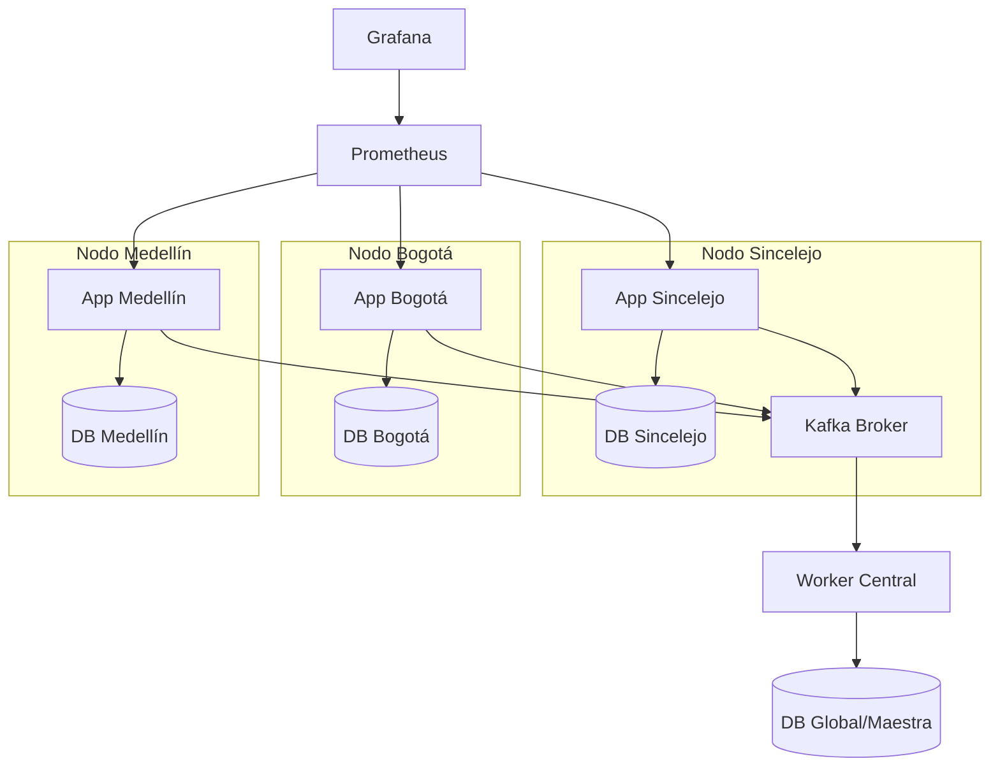

# Sistema Clínico Distribuido Interoperable (FHIR R4)

Este proyecto implementa un sistema de gestión de historias clínicas distribuido en tres nodos geográficos (Sincelejo, Bogotá y Medellín), utilizando el estándar internacional **FHIR R4** para asegurar la interoperabilidad y **Apache Kafka** para la sincronización de eventos en tiempo real.

## 🏗️ Arquitectura del Sistema

La arquitectura está diseñada para ser resiliente y escalable, simulando una red WAN de salud.



### Características Principales:
- **Resiliencia (Offline First):** Si un nodo pierde conexión con la red (Kafka), almacena los eventos localmente y los resincroniza automáticamente al recuperar la conexión.
- **Failover de Base de Datos:** Los servidores de aplicación pueden conmutar automáticamente a bases de datos de otros nodos si la local falla.
- **Observabilidad:** Stack completo de monitoreo con Prometheus y Grafana.

## 🚀 Guía de Despliegue

### Requisitos:
- Docker y Docker Compose instalado.
- Mínimo 8GB de RAM disponibles.

### Pasos para iniciar:
1. Clonar el repositorio.
2. Iniciar el stack completo:
   ```bash
   docker-compose up -d
   ```
3. Acceder al portal principal:
    - Portal de Login: `http://localhost:3004/login-medico` (gateway con autenticación)
    - **Acceso unificado vía Gateway:** `http://localhost:3005`
      - `/registro-paciente` - Registro de pacientes
      - `/consulta-hc` - Consulta de historias clínicas
      - `/triage?id=<ID>` - Módulo de triage
      - `/paciente/<ID>` - Historia clínica individual
      - `/reportes` - Reportes y estadísticas
      - `/monitor-nodos` - Estado de los nodos
    - Sincelejo: `http://localhost:3001`
    - Bogotá: `http://localhost:3002`
    - Medellín: `http://localhost:3003`

## 🏥 Estándares y Seguridad

### Interoperabilidad FHIR:
El sistema emula un servidor **Hapi FHIR R4**, exponiendo endpoints estandarizados:
- `GET /api/v1/fhir/metadata`: Retorna el `CapabilityStatement` del servidor.
- `GET /api/v1/fhir/patients`: Consulta de recursos Patient FHIR.
- `GET /api/debug/replica/:id`: Diagnóstico de replicación WAN por paciente (sede origen, última escritura y secciones FIRH presentes).
- `GET /api/sync/resumen`: Lista pacientes del nodo actual (para comparar sedes).
- `POST /api/sync/replicar-todo`: Republica todos los pacientes locales a Kafka (recuperar desfases si Kafka no estaba activo al registrar).
- `POST /api/sync/replicar-paciente/:id`: Republica un paciente puntual.

### Seguridad (SMART on FHIR):
- Implementación de **OAuth2 con JWT**.
- Middlewares de verificación de tokens para proteger la información sensible del paciente.

## 📊 Monitoreo y Métricas

- **Prometheus:** Recolecta métricas de uptime, volumen de peticiones y errores de sincronización de cada nodo en el puerto `9090`.
- **Grafana:** Visualización de dashboards en el puerto `3006` (Admin: `admin` / `admin`).

### Acceso Single Page Application (SPA)
- El gateway en puerto `3005` expone todas las funcionalidades con replicación automática a las sedes.
- Los datos se guardan en BD global y se replican a otros nodos.
- Si un nodo está caído, los datos quedan en cola y se sincronizan al recuperarse.

## 🛠️ Tecnologías Utilizadas
- **Backend:** Node.js / Express
- **Base de Datos:** PostgreSQL (Alpine)
- **Mensajería:** Apache Kafka
- **Monitoreo:** Prometheus & Grafana
- **Diseño:** HTML5, CSS3, Chart.js

---
**Desarrollado para la Clase del Estimado - Parcial Final - Corposucre 2026**

## imagenes del projecto


link del video

https://drive.google.com/file/d/1x2oziY7B-sqx8vEJ1bxvk69BulVrRSkm/view?usp=sharing
